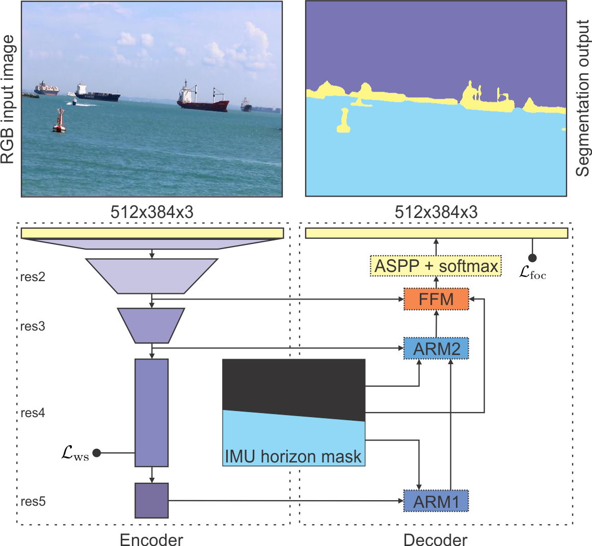
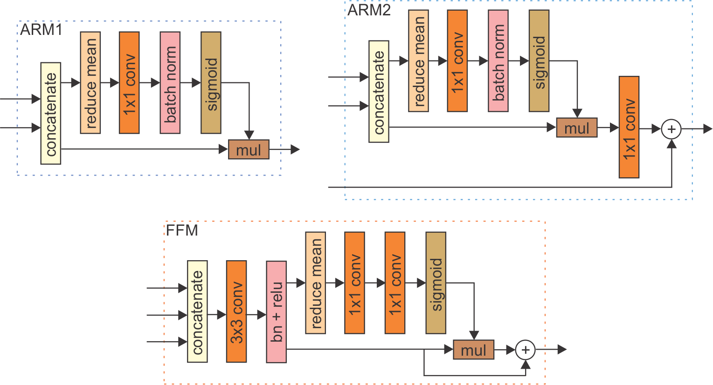
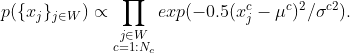
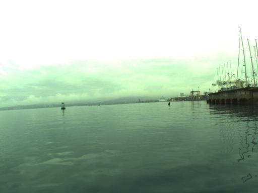
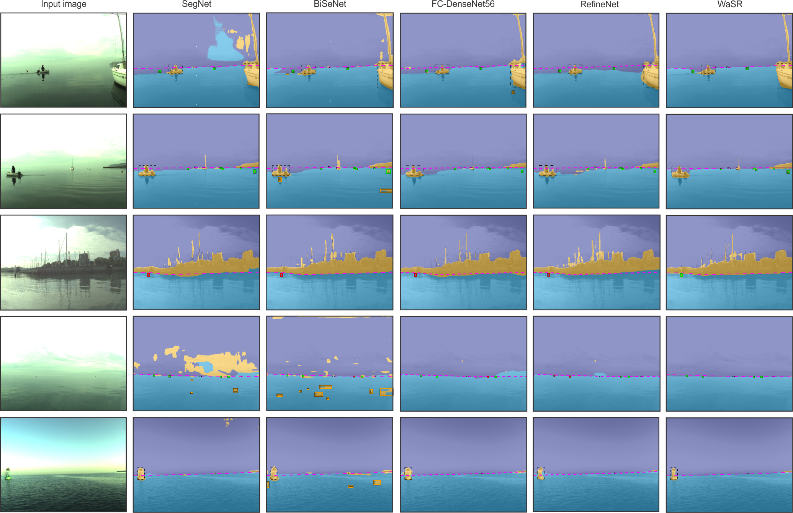

# WaSR - A water-obstacle separation and refinement network for unmanned surface vehicles
https://arxiv.org/abs/2001.01921 (ICRA 2020)



Obstacle detection by semantic segmentation shows a great promise for autonomous navigation in unmanned surface vehicles (USV). However, existing methods suffer from poor estimation of the water edge in the presence of visual ambiguities, poor detection of small obstacles and high false-positive rate on water reflections and wakes. We propose a new deep encoder-decoder architecture, a water-obstacle separation and refinement network (WaSR), to address these issues. Detection and water edge accuracy are improved by a novel decoder that gradually fuses inertial information from IMU with the visual features from the encoder. In addition, a novel loss function is designed to increase the separation between water and obstacle features early on in the network. Subsequently, the capacity of the remaining layers in the decoder is better utilised, leading to a significant reduction in false positives and increased true positives. Experimental results show that WaSR outperforms the current state-of-the-art by a large margin, yielding a 14% increase in F-measure over the second-best method.

Updates:
* [March 2020] <a href="https://github.com/clunietp">Thomas Clunie</a> ported WaSR to Python3 and Tensorflow 1.15.2 
* [February 2020] Initial commit

To-Do:
* Port the IMU variation fully to Python
* Upload requirements.txt file for quick installation
* Re-upload weights
* Update the read-me file

## 1. Installation
### Requirements
To successfully run WaSR you will need the following packages:
* <a href="https://www.python.org/">Python</a> >= 2.7.14
* <a href="https://opencv.org/">OpenCV</a> >= 3.4
* <a href="https://www.tensorflow.org/">Tensorflow</a> >= 1.2.0 (GPU) / >= 1.4.1 (CPU)
* <a href="https://matplotlib.org/">MatPlotLib</a>
* <a href="https://numpy.org/">Numpy</a>

Execute the following sequence of commands to download and install required packages and libraries (Ubuntu):
```
$ sudo apt-get update
$ sudo apt-get install python2.7
$ sudo apt-get install python-opencv
$ pip install -r requirements.txt
```

## 2. Architecture overview
The WaSR architecture consists of a contracting path (encoder) and an expansive path (decoder). The purpose of the encoder is construction of deep rich features, while the primary task of the decoder is fusion of inertial and visual information, increasing the spatial resolution and producing the segmentation output.

### Encoder
Following the recent analysis [1] of deep networks on a maritime segmentation task, we base our encoder on the low-to-mid level backbone parts of DeepLab2 [2], i.e., a ResNet-101  [3]  backbone  with  atrous  convolutions.  In  particular, the model is composed of four residual convolutional blocks (denoted as res2, res3, res4 and res5) combined with  max-pooling layers. Hybrid atrous convolutions are added to the last two blocks for increasing the receptive field and encoding a local context information into deep features.

### Decoder
The primary tasks of the decoder is fusion of visual and inertial information. We introduce the inertial information by constructing an IMU feature channel that encodes location  of horizon at a pixel level. In particular, <a href="https://github.com/bborja/camera-imu-calib">camera-IMU projection</a> [4] is used to estimate the horizon line and a binary mask with all pixels below the horizon set to one is constructed. This IMU mask serves a prior probability of water location and for improving the estimated location of the water edge in the output segmentation.

The IMU mask is treated as an externally generated feature channel, which is fused with the encoder features at multiple levels of the decoder. However, the values in the IMU channel and the encoder features are at different scales. To avoid having to manually adjust the fusion weights, we apply approaches called Attention  Refinement  Modules  (ARM) and Feature Fusion Module (FFM) proposed by [5] to learn an optimal fusion strategy.

The final block of the decoder is Atrous Spatial Pyramid Pooling (ASPP) module [2], followed by a softmax which improve the segmentation of small structures (such as small buoys) and produces the final segmentation mask.

<p align="center">
 
</p>

### Semantic seperation loss
Since we would like to enforce clustering of water features, we can approximate their distribution by a Guassian with per-channel means and variances, where we assume channel independence for computational tractability. Similarity of all other pixels corresponding to obstacles can be measured as a joint probability under this Gaussian, i.e.,

<p align="center">
 
</p>

We would like to enforce learning of features that minimize this probability. By expanding the equation for water per-channel standard deviations, taking the log of the above equation, flipping the sign and inverting, we arrive at the following equivalent obstacle-water separation loss

<p align="center">
 
</p>

## 3. Running WaSR

### Training
To train the network from scratch (or from some pretrained weights) use scripts <i>wasr_train_noimu.py</i> for the NO-IMU variation or <i>wasr_train_imu.py</i> for the IMU variation. Both scripts expect the same input arguments. When fine-tunning the network make sure to freeze the pretrained parameters for initial <i>n</i> iterations and train only the last layer.

#### Input Arguments
* `batch-size` - <i>number of images sent to the network in one step</i>
* `data-dir` - <i>path to the directory containing the MODD2 dataset</i>
* `data-list` - <i>path to the file listing the images in the dataset</i>
* `grad-update-every` - <i>number of steps after which gradient update is applied</i>
* `ignore-label` - <i>the value of the label to ignore during the training</i>
* `input-size` - <i>comma-separated string with height and width of images (default: 384,512)</i>
* `is-training` - <i>whether to update the running means and variances during the training</i>
* `learning-rate` - <i>base learning rate for training with polynomial decay</i>
* `momentum` - <i>moment component of the optimiser</i>
* `not-restore-last` - <i>whether to no restore last layers (when using weights from pretrained encoder network)</i>
* `num-classes` - <i>number of classes to predict</i>
* `num-steps` - <i>number of training steps (this are not epoch!)</i>
* `power` - <i>decay parameter to compute the learning rate</i>
* `restore-from` - <i>where restore model parameters from</i>
* `snapshot-dir` - <i>where to save snapshots of the model</i>
* `weight-decay` - <i>regularisation parameter for L2-loss</i>

#### Pretrained Weights
* `WaSR NO-IMU variant` - weights are available for download <a href="https://drive.google.com/drive/folders/18SVQF-2q9wxBU1BM1ULwIW2dF9x3yVNj?usp=sharing">here</a>
* `WaSR IMU variant` - To-Do

### Inference
To perform the inference on a specific single image use scripts <i>wasr_inference_noimu_general.py</i> for the WaSR NO-IMU variant or <i>wasr_inference_imu_general.py</i> for the WaSR IMU variant. Both scripts expect the same input arguments and can be run on images from arbitrary maritime dataset.

#### Input Arguments (General Inference)
* `dataset-path` - <i>path to MODD2 dataset files on which inference is performed</i>
* `model-weights` - <i>path to the file with model weights</i>
* `num-classes` - <i>number of classes to predict</i>
* `save-dir` - <i>where to save predicted mask</i>
* `img-path` - <i>path to the image on which we want to run inference</i>

Example usage:
```
python wasr_inference_noimu_general.py --img-path example_1.jpg
```
The above command will take image <i>example_1.jpg</i> from folder <i>test_images/</i> and segment it. The segmentation result will be saved in the <i>output/</i> folder by default.
<table>
<tr>
 <td>Example input image</td> <td>Example segmentation output</td>
</tr>
<tr>
 <td></td> <td></td>
</tr>
</table>

---

To run the inference on the <a href="https://box.vicos.si/borja/viamaro/index.html">MODD2 dataset</a> use the provided bash scripts <i>wasr_inferences_noimu.sh</i> for the WaSR NO-IMU variant or </i>wasr_inferences_imu.sh</i> for the WaSR IMU variant. Bash scripts will run corresponding Python codes (<i>wasr_inference_noimu.py</i> and <i>wasr_inference_imu.py</i>).

#### Input Arguments (Python MODD2 inference script)
* `dataset-path` - <i>path to MODD2 dataset files on which inference is performed</i>
* `model-weights` - <i>path to the file with model weights</i>
* `num-classes` - <i>number of classes to predict</i>
* `save-dir` - <i>where to save predicted mask</i>
* `seq` - <i>sequence number to evaluate</i>
* `seq-txt` - <i>path to the file listing the images in the sequence</i>

<p align="center">
 
</p>

## 4. References
[1] Bovcon et. al, The MaSTr1325 Dataset for Training Deep USV Obstacle Detection Models, IROS 2019<br>
[2] Chen et. al, Deeplab: Semantic image segmentation with deep convolutional nets, atrous  convolution, and fully connected crfs, TPAMI 2018<br>
[3] He et. al, Deep residual learning for image recognition, CVPR 2016<br>
[4] Bovcon et. al, Stereo Obstacle Detection for Unmanned Surface Vehicles by IMU-assisted Semantic Segmentation, RAS 2018<br>
[5] Yu et. al, Bisenet: Bilateral segmentation network for real-time semantic segmentation, ECCV 2018
